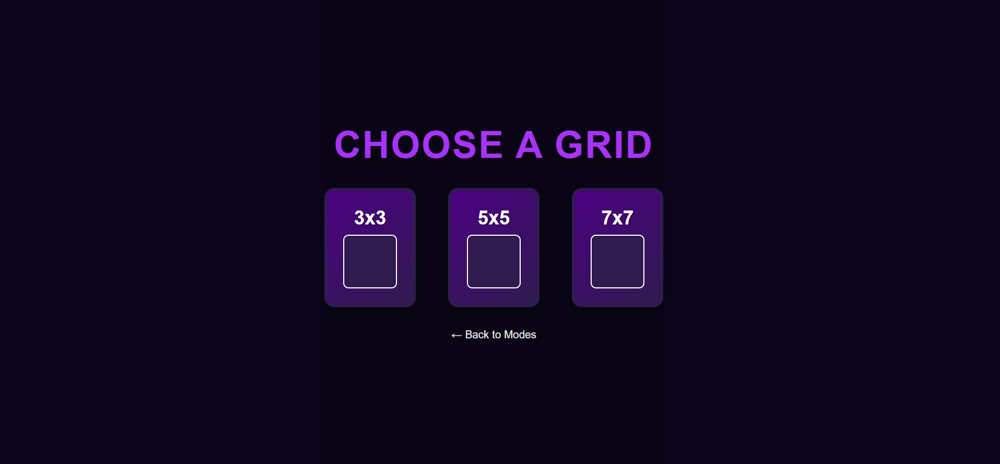
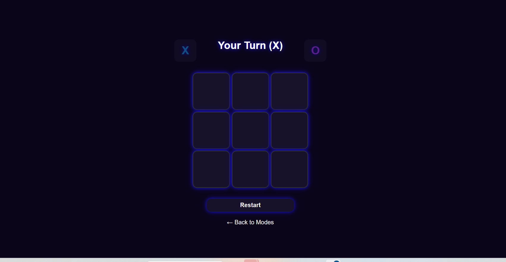

# 🚀 Features

* Multiple Board Sizes: 3x3, 5x5, 7x7 
* Player vs Player and Player vs Computer modes
* Smart Computer AI with difficulty scaling per board size
* Sound Effects: tie, win, lose
* Responsive Design – Works on desktop and mobile
* Local Templates for offline play
* Clean UI with hover effects and win animations

# 🎮 How to Play

1. Open templates/index.html in your browser.
2. Choose board size: 3x3, 5x5, or 7x7
3. Select mode:
    - Player vs Player
    - Player vs Computer

4. Click on cells to place X or O
5. First to align required marks in a row wins!
    - 3x3 → 3 in a row
    - 5x5 → 4 in a row
    - 7x7 → 5 in a row

# 🤖 Computer AI

- Uses Minimax algorithm (optimized with alpha-beta pruning)
- Smarter on smaller boards, strategic on larger ones
- Difficulty increases with board size

# 🎵 Sounds

- tie.mp3 – Played on draw
- lose.mp3 – Played when a player loses
- win.mp3 –  Played when a player Win

# 📱 Responsive
- Fully playable on:
    - Desktop
    - Tablets
    - Mobile phones

# ScreenShot
* Homepage

* Choosepage

* GameBoard

